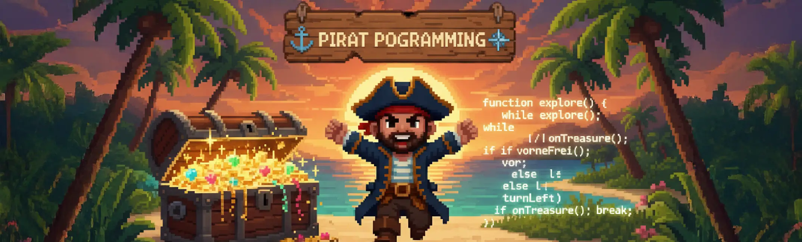

[](https://opensource.org/licenses/MIT)
[](https://nodejs.org/)
[](https://vitejs.dev/)

Ein interaktives Browser-basiertes Lernspiel, das spielerisch JavaScript-Programmierlogik vermittelt. Inspiriert vom bekannten Hamstersimulator, navigieren Spieler einen Piraten durch verschiedene Level und lernen dabei grundlegende Programmierkonzepte wie Schleifen, Bedingungen und Funktionen.

## ✨ Features

- 🎮 **Interaktives Gameplay**: Visueller Monaco-Editor mit Syntax-Highlighting
- 🗺️ **Level-System**: 9 vorgefertigte Level mit steigendem Schwierigkeitsgrad
- 🛠️ **Level-Editor**: Erstelle und teile deine eigenen Level
- 🌐 **Mehrsprachig**: Deutsche und englische Funktionsnamen
- 🎨 **Pixel-Art Stil**: Nostalgisches Gaming-Design
- 📱 **Responsive**: Funktioniert auf Desktop und Tablet
- 💾 **Import/Export**: Speichere und lade Level als JSON-Dateien

## 🚀 Schnellstart

### Voraussetzungen

- Node.js 16+
- npm oder yarn

### Installation

1. **Repository klonen**:

```bash
git clone https://github.com/pauljk-hb/Pirat-Programming-Learning.git
cd pirat-programming
```

2. **Abhängigkeiten installieren**:

```bash
npm install
```

3. **Entwicklungsserver starten**:

```bash
npm run dev
```

4. **Für Produktion bauen**:

```bash
npm run build
```

Die Anwendung ist dann unter `http://localhost:5173` verfügbar.

## 🎯 Spielprinzip

Der Spieler steuert einen Piraten auf einer Inselkarte mit JavaScript-Funktionen. Ziel ist es, den Schatz zu erreichen, während verschiedene Hindernisse umgangen werden müssen. Durch das Schreiben von Code lernen Spieler:

- Grundlegende Programmierstrukturen
- Schleifen (`while`, `for`)
- Bedingte Anweisungen (`if`, `else`)
- Funktionsdeklarationen
- Algorithmisches Denken

## 🕹️ Verfügbare Funktionen

### Bewegung

- **`move()` / `vor()`**: Bewegt den Piraten einen Schritt vorwärts
- **`turnLeft()` / `links()`**: Dreht den Piraten um 90° nach links

### Sensoren

- **`noWater()` / `vorneFrei()`**: Prüft, ob vor dem Piraten Land ist (`true`/`false`)
- **`onTreasure()` / `aufSchatz()`**: Prüft, ob der Pirat auf dem Schatz steht (`true`/`false`)
- **`onMarker()` / `aufMarkierung()`**: Prüft, ob der Pirat auf einer Markierung steht (`true`/`false`)

### Aktionen

- **`setMarker()` / `setzteMarkierung()`**: Setzt eine Markierung an der aktuellen Position

### Beispiel-Code

```javascript
function findTreasure() {
  while (!onTreasure()) {
    if (noWater()) {
      move();
    } else {
      turnLeft();
    }
  }
}

findTreasure();
```

## 🏗️ Architektur

Das Projekt folgt einer modularen Architektur mit klarer Trennung von Verantwortlichkeiten:

```
src/
├── Game/
│   ├── GameAPI.js          # 🎮 Haupt-API für Spielsteuerung
│   └── core/
│       ├── GameController.js    # 🎯 Zentrale Spiellogik & Zustandsverwaltung
│       ├── Renderer.js          # 🎨 Canvas-Rendering & Grafik
│       ├── UserFunctions.js     # 🔧 Spieler-API Funktionen
│       ├── CodeParser.js        # 📝 JavaScript Code-Analyse
│       ├── LevelLoader.js       # 💾 Level Import/Export
│       ├── InputHandler.js      # ⌨️ Eingabeverarbeitung
│       ├── Utils.js             # 🛠️ Hilfsfunktionen
│       └── editor/
│           ├── monaco-config.js     # ⚙️ Monaco Editor Konfiguration
│           └── monaco-worker-loader.js # 👷 Web Worker Setup
├── scripts/
│   ├── home.js             # 🏠 Startseiten-Controller
│   ├── game.js             # 🎮 Spiel-Controller
│   └── editor.js           # ✏️ Level-Editor Controller
└── styles/                 # 🎨 CSS Styling
```

### Datenfluss

1. **GameAPI** initialisiert alle Kernmodule
2. **GameController** verwaltet Spielzustand und -logik
3. **UserFunctions** stellt die Programmier-API bereit
4. **CodeParser** analysiert und führt Benutzercode aus
5. **Renderer** aktualisiert die visuelle Darstellung

## 📦 Wichtige Module

### GameAPI.js

Haupteinstiegspunkt der Anwendung. Koordiniert alle anderen Module und stellt die öffentliche API bereit.

**Kernfunktionen:**

- Initialisierung des Spiels
- Code-Ausführung mit Fehlerbehandlung
- Integration des Monaco Editors
- Bereitstellung der Benutzer-API im globalen Scope

### GameController.js

Zentrale Spiellogik-Verwaltung mit Zustandskontrolle.

**Kernfunktionen:**

- `initGame(levelData)` - Level-Initialisierung
- `movePlayer()` - Spielerbewegung mit Kollisionserkennung
- `isValidPosition(x, y)` - Positionsvalidierung
- `resetToUserPosition()` - Spieler-Reset bei Fehlern

### UserFunctions.js

Implementiert alle verfügbaren Spieler-Funktionen mit asynchroner Ausführung.

**API-Funktionen:**

- Bewegung: `move()`, `turnLeft()`
- Sensoren: `noWater()`, `onTreasure()`, `onMarker()`
- Aktionen: `setMarker()`
- Deutsche Aliase: `vor()`, `links()`, `vorneFrei()`, etc.

### CodeParser.js

Sicherer JavaScript-Parser basierend auf Acorn AST.

**Sicherheitsfeatures:**

- Whitelist-basierte Funktionsvalidierung
- Verhinderung schädlicher Konstrukte
- Fehlerbehandlung und -meldung
- Zeitlimit für Code-Ausführung

### Level-Format

```json
{
  "titel": "Level 1: Befehlssequenz",
  "player": {
    "x": 1,
    "y": 8,
    "direction": "up",
    "userX": 1,
    "userY": 8,
    "userDirection": "up"
  },
  "treasure": {
    "x": 6,
    "y": 2
  },
  "map": [
    [0, 0, 0, 0, 0, 0, 0, 0, 0, 0],
    [0, 1, 1, 1, 1, 1, 1, 1, 1, 0],
    [0, 1, 1, 1, 1, 1, 1, 1, 1, 0],
    [0, 1, 1, 1, 1, 1, 1, 1, 1, 0],
    [0, 1, 1, 1, 1, 1, 1, 1, 1, 0],
    [0, 1, 1, 1, 1, 1, 1, 1, 1, 0],
    [0, 1, 1, 1, 1, 1, 1, 1, 1, 0],
    [0, 1, 1, 1, 1, 1, 1, 1, 1, 0],
    [0, 1, 1, 1, 1, 1, 1, 1, 1, 0],
    [0, 0, 0, 0, 0, 0, 0, 0, 0, 0]
  ],
  "code": "",
  "instructions": "<h3>Level 1: Befehlssequenz</h3>\n<p>Willkommen, neuer Pirat! Deine erste Aufgabe ist es, den Schatz zu finden. Gib deinem Piraten schrittweise Anweisungen, um ihn zum Ziel zu steuern. </p>\n<p>Verwende die Befehle <code>vor()</code>, um dich zu bewegen, und <code>links()</code>, um die Richtung zu ändern.</p>\n<p>Die Schätze sind nicht weit entfernt. Du musst einfach nur die Befehle in der richtigen Reihenfolge aufschreiben.</p>\n<h4>Befehle:</h4>\n<ul>\n  <li><code>vor()</code>: Bewegt den Piraten ein Feld vorwärts.</li>\n  <li><code>links()</code>: Dreht den Piraten um 90° nach links.</li>\n</ul>\n<p>Viel Erfolg!</p>",
  "preview": "data:image/png;base64,...."
}

```

**Karten-Encoding:**

- `0` = Wasser (nicht begehbar)
- `1` = Land (begehbar)
- `2` = Kreuz-Markierung

## 🛠️ Technologie-Stack

### Frontend

- **[Vite](https://vitejs.dev/)** - Schneller Build-Tool und Dev-Server
- **[Monaco Editor](https://microsoft.github.io/monaco-editor/)** - VS Code Editor im Browser
- **HTML5 Canvas** - 2D-Rendering und Grafik
- **ES6 Modules** - Moderne JavaScript-Module

### Code-Verarbeitung

- **[Acorn](https://github.com/acornjs/acorn)** - JavaScript-Parser (AST)
- **[Acorn-Walk](https://github.com/acornjs/acorn-walk)** - AST-Traversierung
- **[Astring](https://github.com/davidbonnet/astring)** - AST zu Code-Konvertierung

### UI & Design

- **[Feather Icons](https://feathericons.com/)** - Icon-Set
- **[EasyMDE](https://github.com/Ionaru/easy-markdown-editor)** - Markdown-Editor
- **CSS Grid & Flexbox** - Responsive Layout
- **Custom CSS** - Pixel-Art Gaming-Design

## 🤝 Beitragen

Beiträge sind willkommen! Bitte beachte folgende Schritte:

1. **Fork** das Repository
2. **Branch** erstellen (`git checkout -b feature/AmazingFeature`)
3. **Commit** deine Änderungen (`git commit -m 'Add some AmazingFeature'`)
4. **Push** zum Branch (`git push origin feature/AmazingFeature`)
5. **Pull Request** öffnen

### Entwicklung

```bash
# Entwicklungsserver mit Hot-Reload
npm run dev

# Build für Produktion
npm run build

# Preview der Production-Build
npm run preview

# Tests ausführen
npm run test
```

### Code-Stil

- ES6+ JavaScript
- Modularer Aufbau
- JSDoc-Kommentare für öffentliche APIs
- Semantische HTML-Struktur

## 📝 Level-Erstellung

Erstelle eigene Level im JSON-Format:

```json
{
  "titel": "Mein Level",
  "player": { "x": 0, "y": 0, "direction": "up" },
  "treasure": { "x": 4, "y": 4 },
  "map": [
    [1, 1, 1, 1, 1],
    [1, 0, 0, 0, 1],
    [1, 0, 1, 0, 1],
    [1, 0, 0, 0, 1],
    [1, 1, 1, 1, 1]
  ],
  "instructions": "<h3>Finde den Schatz!</h3><p>Verwende Schleifen...</p>",
  "initialCode": "// Dein Code hier..."
}
```

## 🐛 Bekannte Probleme

- Monaco Editor kann bei langsamen Verbindungen verzögert laden
- Canvas-Rendering kann auf älteren Browsern Performance-Probleme haben
- Touch-Eingabe auf mobilen Geräten ist experimentell

## � Lizenz

Dieses Projekt steht unter der [MIT-Lizenz](LICENSE).

---

**Viel Spaß beim Programmieren lernen! 🏴‍☠️⚓**
